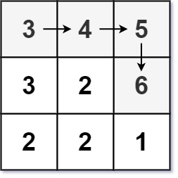

#### [329. 矩阵中的最长递增路径](https://leetcode-cn.com/problems/longest-increasing-path-in-a-matrix/)

难度困难625收藏分享切换为英文接收动态反馈

给定一个 `m x n` 整数矩阵 `matrix` ，找出其中 **最长递增路径** 的长度。

对于每个单元格，你可以往上，下，左，右四个方向移动。 你 **不能** 在 **对角线** 方向上移动或移动到 **边界外**（即不允许环绕）。

 

**示例 1：**


```
输入：matrix = [[9,9,4],[6,6,8],[2,1,1]]
输出：4 
解释：最长递增路径为 [1, 2, 6, 9]。
```

**示例 2：**



```
输入：matrix = [[3,4,5],[3,2,6],[2,2,1]]
输出：4 
解释：最长递增路径是 [3, 4, 5, 6]。注意不允许在对角线方向上移动。
```

**示例 3：**

```
输入：matrix = [[1]]
输出：1
```

 

**提示：**

- `m == matrix.length`
- `n == matrix[i].length`
- `1 <= m, n <= 200`
- `0 <= matrix[i][j] <= 2^31 - 1`


```cpp
class Solution {
public:
    int longestIncreasingPath(vector<vector<int>>& matrix) {

    }
};
```

