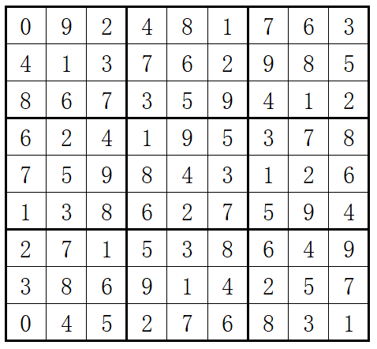
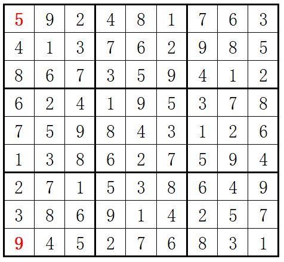

坚持刷题可以获得牛币和挂件等多种奖励，[点击此处](https://www.nowcoder.com/activity/coding-2021/index/5)立即进入活动页面

[](https://www.nowcoder.com/profile/2127843)

HJ44 Sudoku


- 题目
- 题解(65)
- 讨论(111)
- 排行

困难 通过率：30.92% 时间限制：1秒 空间限制：32M

知识点[思维](https://www.nowcoder.com/exam/oj/ta?tpId=37?tag=5048)[基础数学](https://www.nowcoder.com/exam/oj/ta?tpId=37?tag=5050)[搜索](https://www.nowcoder.com/exam/oj/ta?tpId=37?tag=3381)

 校招时部分企业笔试将禁止编程题跳出页面，为提前适应，练习时请使用在线自测，而非本地IDE。

## 描述

问题描述：数独（Sudoku）是一款大众喜爱的数字逻辑游戏。玩家需要根据9X9盘面上的已知数字，推算出所有剩余空格的数字，并且满足**每一行、每一列、每一个3X3** **粗线宫内**的数字均含1-9，并且不重复。

例如：

输入



输出



数据范围：输入一个 9*9 的矩阵

### 输入描述：

包含已知数字的9X9盘面数组[空缺位以数字0表示]

### 输出描述：

完整的9X9盘面数组

## 示例1

输入：

```
0 9 2 4 8 1 7 6 3
4 1 3 7 6 2 9 8 5
8 6 7 3 5 9 4 1 2
6 2 4 1 9 5 3 7 8
7 5 9 8 4 3 1 2 6
1 3 8 6 2 7 5 9 4
2 7 1 5 3 8 6 4 9
3 8 6 9 1 4 2 5 7
0 4 5 2 7 6 8 3 1
```

复制

输出：

```
5 9 2 4 8 1 7 6 3
4 1 3 7 6 2 9 8 5
8 6 7 3 5 9 4 1 2
6 2 4 1 9 5 3 7 8
7 5 9 8 4 3 1 2 6
1 3 8 6 2 7 5 9 4
2 7 1 5 3 8 6 4 9
3 8 6 9 1 4 2 5 7
9 4 5 2 7 6 8 3 1
```

复制

相似企业真题