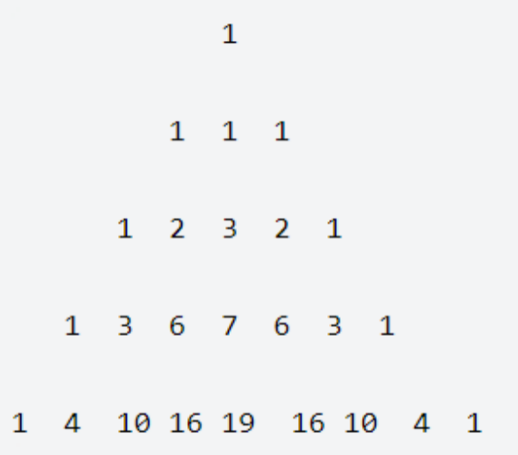

[](https://www.nowcoder.com/profile/2127843)

HJ53 杨辉三角的变形


- 题目
- 题解(127)
- 讨论(318)
- 排行

简单 通过率：48.33% 时间限制：1秒 空间限制：32M

知识点[基础数学](https://www.nowcoder.com/exam/oj/ta?page=2&tpId=37&type=37?tag=5050)

 校招时部分企业笔试将禁止编程题跳出页面，为提前适应，练习时请使用在线自测，而非本地IDE。

## 描述



以上三角形的数阵，第一行只有一个数1，以下每行的每个数，是恰好是它上面的数、左上角数和右上角的数，3个数之和（如果不存在某个数，认为该数就是0）。

求第n行第一个偶数出现的位置。如果没有偶数，则输出-1。例如输入3,则输出2，输入4则输出3，输入2则输出-1。

数据范围： 1 \le n \le 10^9 \1≤*n*≤109 

### 输入描述：

输入一个int整数

### 输出描述：

输出返回的int值

## 示例1

输入：

```
4
```

复制

输出：

```
3
```

复制

相似企业真题