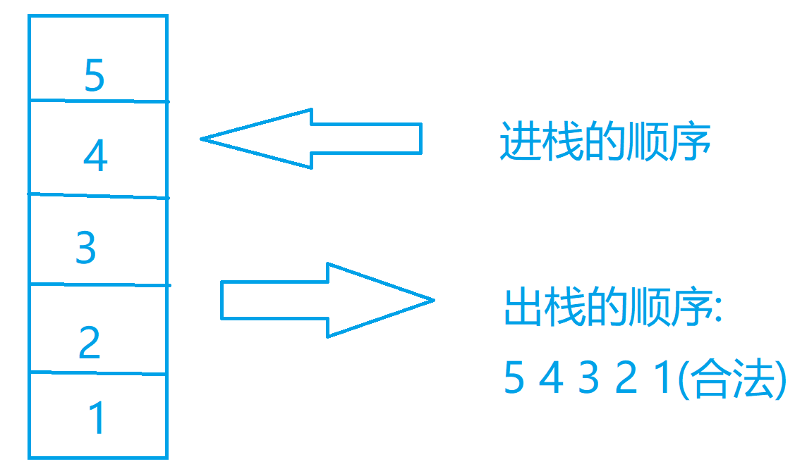

## 题解 | #火车进站#

发表于 2021-06-25 14:25:18

todo : 增加说明

```cpp
#include <algorithm>
#include <iostream>
#include <stack>
#include <vector>
using namespace std;

void dfs(const vector<int>& in, int index, stack<int>& st, vector<int>& out, vector<vector<int>>& res)
{
    if (index >= in.size() && st.empty()) {
        res.push_back(out);
        return;
    }
    // 进
    if (index < in.size()) {
        st.push(in[index]);
        dfs(in, index + 1, st, out, res);
        st.pop();
    }
    // 出
    if (!st.empty()) {
        out.push_back(st.top());
        st.pop();
        dfs(in, index, st, out, res);
        st.push(out.back());
        out.pop_back();
    }
}

int main()
{
    int n;
    while (cin >> n) {
        vector<int> nums(n);
        for (int i = 0; i < n; ++i) { cin >> nums[i]; }
        stack<int> st;
        vector<int> path;
        vector<vector<int>> res;
        dfs(nums, 0, st, path, res);
        sort(res.begin(), res.end());
        for (auto p : res) {
            for (int a : p) { cout << a << " "; }
            cout << endl;
        }
    }
    return 0;
}

```

[](https://www.nowcoder.com/profile/653171091)461 浏览[(8)](javascript:void(0);)[(0)](https://blog.nowcoder.net/n/c6ec28c0547a48cb9e1055b01dedb3b3?f=comment)[收起](javascript:void(0);)

## 题解 | #火车进站#

发表于 2021-12-06 21:53:12

**题意：**

​    **给定入栈序列，** **输出所以的以字典序从小到大排序的出栈序列。**

**方法一：**

**全排列函数+栈**

> 思路：
>
> ​    从小到大全排列所有的出栈序列。
>
> ​    并根据入栈序列判断该出栈序列是否正确；
>
> ​     如果正确则输出该出栈序列。
>
>   
>
>   根据入栈序列判断该出栈序列是否正确：（图示方法如下）
>
>   

```cpp
#include <bits/stdc++.h>

using namespace std;
int n,a[15],c[15];

//根据入栈序列判断出栈序列是否正确
bool check(int b[]){
    stack<int> st;//栈
    int j=0;
    for(int i=0;i<n;i++){//遍历入栈序列
       st.push(a[i]);
        while(!st.empty()&&b[j]==st.top()){//如果栈顶元素等于出栈序列元素，则栈顶元素出栈并出栈序列下标加一
            st.pop();
            j++;
        }
    }
    return st.empty();//判断栈是否为空
}

int main(){
    while(cin >> n){
        for(int i=0;i<n;i++){//输入入栈序列
            cin >> a[i];
            c[i]=a[i];
        }
        //排序
        sort(c,c+n);
        //全排列出栈序列
        do{
            if(check(c)){//如果成功，则输出该出栈序列
                for(int i=0;i<n;i++){
                    cout << c[i] << " ";
                }
                cout << endl;
            }
        }while(next_permutation(c,c+n));
        
    }
    return 0;
}
```

> 

**方法二：**

**dfs+栈**

> 思路：
>
> ​    利用dfs实现 从小到大全排列所有的出栈序列。
>
> ​    再判断每个出栈序列是否正确，正确则输出。

```cpp
#include <bits/stdc++.h>

using namespace std;
int n,a[15],c[15],temp[15];
int vis[15];

//根据入栈序列判断出栈序列是否正确
bool check(int b[]){
    stack<int> st;//栈
    int j=0;
    for(int i=0;i<n;i++){//遍历入栈序列
       st.push(a[i]);
        while(!st.empty()&&b[j]==st.top()){//如果栈顶元素等于出栈序列元素，则栈顶元素出栈并出栈序列下标加一
            st.pop();
            j++;
        }
    }
    return st.empty();//判断栈是否为空
}

void dfs(int x){
    if(x==n){
        if(check(temp)){//如果成功，则输出该出栈序列
            for(int i=0;i<n;i++){
                cout << temp[i] << " ";
            }
            cout << endl;
        }
        return;
    }
    for(int i=0;i<n;i++){//遍历数组
        int y=c[i];
        if(vis[y]==0){//如果未访问，则访问
            vis[y]=1;
            temp[x]=y;
            dfs(x+1);
            vis[y]=0;
        }
        
    }
}
int main(){
    while(cin >> n){
        for(int i=0;i<n;i++){//输入入栈序列
            cin >> a[i];
            c[i]=a[i];
        }
        //排序
        sort(c,c+n);
        //dfs全部的出栈序列
        dfs(0);
        
    }
    return 0;
}
```


> 

[](https://www.nowcoder.com/profile/406266314)358 浏览[(6)](javascript:void(0);)[(0)](https://blog.nowcoder.net/n/bca88715edd248699c42b356c70bb27f?f=comment)[收起](javascript:void(0);)

## 题解 | #火车进站#

发表于 2022-03-10 16:47:26

# 题目描述

我们输入一个n, 代表我们有n个火车, 接下来我们输入n个数字, 代表了我们的火车的入站的顺序, 然后给问我们有多少种出站的顺序, 要求从字典序小到大输出

# 题解

## 解法一: 全排列

### 实现思路

我们可以知道这么一个问题, 我们的全排列函数是从字典序从小到大的, 然后我们直接调用这个函数就可以了, 每次我们去检测一下我们当前的这个序列是否可以根我们一开始的入站顺序所构成, 如果可以构成, 那么我们这个就是成立的, 否则就是不成立的

### 图解代码




### 代码实现

```cpp
#include <bits/stdc++.h>

using namespace std;

bool check(vector<int> &a, vector<int> &cmp) {
    stack<int> st;
    int j = 0, i = 0;
    for (i = 0; i < a.size(); i++) {
        // 依次把我们的a数组中的数入栈
        st.push(a[i]);
        while (j < a.size() && st.size() != 0 && cmp[j] == st.top()) {
            // 依次判断每cmp每个序列的值是否与栈顶相等
            st.pop();
            j++;
        }
    }
    return st.empty();
    // 判断是否可以一一对应上, 可以的话, 就是我们最后的答案
}

signed main() {
    int n;
    cin >> n;
    vector<int> a(n);
    for (auto &it : a) cin >> it;
    vector<int> cmp = a;
    // 我们输入我们的这个数组, 然后我们开一个临时数组
    sort(cmp.begin(), cmp.end());
    // 这个我们先排序
    do {
        if (check(a, cmp)) {
            for (int i = 0; i < n; i++) cout << cmp[i] << " \n"[i == n - 1];
        }
        // 如果可以满足条件, 我们就直接输出
    } while (next_permutation(cmp.begin(), cmp.end()));
    return 0;
}

```

### 时空复杂度分析

**时间复杂度:** O(n∗n!)O(n * n!)*O*(*n*∗*n*!)

理由如下: 我们的全排列的函数他的时间复杂度是n!n!*n*!, 然后我们每次判断的时间复杂度是nn*n*的, 所以我们的时间复杂度就是两部分之积

**空间复杂度:** O(n)O(n)*O*(*n*)

理由如下: 事实上我们只是简单的开辟了两个长度为n的数组, 还有一个存储的栈结构, 所以我们的空间复杂度是O(n)O(n)*O*(*n*)的

## 解法二: DFS

### 实现思路

我们其实可以发现, 我们其实每次就是两个操作, 一个是入栈, 一个出栈, 然后因为我们解法一的本质其实就是全排列问题, 我们这里的全排列用dfs实现就可以了, 详细过程在代码的注释里面

### 代码实现

```cpp
#include <bits/stdc++.h>

using namespace std;

signed main() {
    int n;
    cin >> n;
    vector<int> a(n);
    for (auto &it : a) cin >> it;
    stack<int> st;
    // 在我们栈里面的车
    vector<int> tmp;
    // 这个是我们出栈的车是什么
    set<vector<int>> res;
    // 这个是我们的答案,为了实现字典序最小
    function<void(int)> dfs = [&](int idx) {
        if (tmp.size() == a.size()) {
            // 说明我们是全部出栈了
            res.insert(tmp);
            return;
        }
        for (int i = 1; i <= 2; i++) {
            if (i == 1 && idx < a.size()) {
                // 这个是我们入栈
                st.push(a[idx]);
                dfs(idx + 1);
                st.pop();
                // 我们入栈一个, 然后向下递归
            } else if (i == 2 && !st.empty()) {
                tmp.push_back(st.top());
                st.pop();
                // 我们弹出一个
                dfs(idx);
                st.push(tmp.back());
                tmp.pop_back();
                // 我们回复现场
            }
        }
    };
    dfs(0);
    for (auto &it : res) {
        for (int i = 0; i < it.size(); i++) {
            cout << it[i] << " \n"[i == it.size() - 1];
        }
    }
    return 0;
}
```

### 时空复杂度分析

**时间复杂度:** *O*(*n*!*l**o**g*(*n*!))

理由如下: 我们最坏的情况下, 我们需要用dfs遍历全排列的情况, 那么我们很容易可以发现就是n!的,然后我们的set的复杂度会带一个log, 所以我们最坏的情况就是O(n!log(n!))O(n!log(n!))*O*(*n*!*l**o**g*(*n*!))

**空间复杂度:** *O*(*n*∗*n*!)

理由如下：我们最大会存储全排列种的情况也就是n!的情况, 然后我们每个里面有n个元素

[](https://www.nowcoder.com/profile/514903189)149 浏览[(1)](javascript:void(0);)[(0)](https://blog.nowcoder.net/n/cd99645eca34485086ee7c0e31ab3d3d?f=comment)[收起](javascript:void(0);)

## 题解 | #火车进站#

发表于 2021-12-09 21:43:46

HJ77火车进站

**一.题目描述**

给出一组序列，请求输出其所有的出栈的合法序列。


**二.算法二(暴力)**

开始看到题目感觉很熟悉却又很懵，该怎么去判断出栈顺序呢？我们不妨想到无论怎么样，出栈的顺序一定被包含于所给数列的全排列中，所以问题就转换为了怎么去判断一个序列是不是合法的出栈序列？


对于如何判断序列是不是合法的出栈序列我们有了一定认识，下面给出完整的代码和注释：

```cpp
#include<bits/stdc++.h>
using namespace std;
const int N=25;
int st[N],a[N];
int n;
bool check(){
    stack<int>s;
    int cnt=1;
    for(int i=1;i<=n;i++){
        s.push(a[i]);
        //栈顶元素和出栈元素相等 下标后移一位
        while(s.size()&&st[cnt]==s.top()){
            s.pop();
            cnt++;
        }
    }
    if(s.size()){
        return false;
    }
    return true;
}
int main(){
    cin>>n;
    for(int i=1;i<=n;i++){
        cin>>a[i];
        st[i]=a[i];
    }
    //需要对a进行全排列，先对其进行排序
    sort(st+1,st+1+n);
    do{
        if(check()){
            for(int i=1;i<=n;i++){
                cout<<st[i]<<" ";
            }
            cout<<endl;
        }
    } while(next_permutation(st+1,st+1+n));//利用next_permutation实现全排列
    return 0;
}

```

时间复杂度：O*(*n*∗*n*!)，全排列的复杂度为*O*(*n*!)，所以时间复杂度是*O*(*n*∗*n*!)。

空间复杂度：*O*(*n*)，需要空间来存储全排练的数列。

三.算法二(dfs搜索)

前面我们是依赖于next_permutation函数来实现全排练，我们也可以用dfs来构建全排列，每次都有着两个分支，要么实现出栈，要么实现入栈，每次操作完都需要回溯才能够实现检查全排列，如果某一种输出长度到了n说明这种序列结束了，可以输出。但是由于遍历过程中存在重复的现象，我们可以使用set去重，然后输出，下面是完整代码：

```cpp
#include<bits/stdc++.h>
using namespace std;
int n;
//now表示当前序列中的顺序
//num表示入栈顺序
//st表示栈的情况
//mp用来去重和储存所有的出栈序列
//idex用来表示入栈序列的下标
//n表示排列需要到达的数目
void dfs(vector<int>& num,stack<int> st,vector<int> now,set<vector<int>> &mp,int idex,int &n){
    if(now.size() == n){
        mp.insert(now);
        return;
    }
    for(int i=1;i<=2;i++){
        //对于栈的两种选择
        if(i==1){//出栈
            if(!st.empty()){
                int ans = st.top();
                st.pop();
                now.push_back(ans);
                dfs(num,st,now,mp,idex,n);
                //回溯
                st.push(ans);
                now.pop_back();
            }

        }else if(i==2){//入栈
            if(idex<n){
                int ans=num[idex];
                st.push(ans);
                idex++;
                dfs(num,st,now,mp,idex,n);
                idex--;
                st.pop();
            }

        }
    }
}
int main(){
        cin>>n;
        vector<int> num(n);
        set<vector<int> > mp;
        stack<int> st;
        vector<int> now;
        for(int i=0;i<n;i++){
            cin>>num[i];
        }
        st.push(num[0]);
        dfs(num,st,now,mp,1,n);
    //输出set去重后的排序
        for(auto it=mp.begin();it!=mp.end();it++){
            for(int i=0;i<n;i++){
                cout << (*it)[i] << " ";
            }
            cout<<endl;
        }
    return 0;
}

```

时间复杂度：*O*(*n*!*l**o**g*2(*n*!))，dfs遍历整个全排列，最坏情况下全排列都要输出，那么时间复杂度就达到了*O*(*n*!*l**o**g*2(*n*!))。

空间复杂度：*O*(*n*∗*n*!),set集合存储序列

[](https://www.nowcoder.com/profile/856062386)259 浏览[(1)](javascript:void(0);)[(0)](https://blog.nowcoder.net/n/87c839f3fcd44ef18943120f9efa3a7c?f=comment)[收起]

## 题解 | #火车进站 回溯#

发表于 2022-03-12 11:55:06

```cpp
#include<bits/stdc++.h>
using namespace std;
int n;
//now表示当前序列中的顺序
//num表示入栈顺序
//st表示栈的情况
//mp用来去重和储存所有的出栈序列
//idex用来表示入栈序列的下标
//n表示排列需要到达的数目
void dfs(vector<int>& num,stack<int> st,vector<int> now,set<vector<int>> &mp,int idex,int &n){
    if(now.size() == n){
        mp.insert(now);
        return;
    }
    for(int i=1;i<=2;i++){
        //对于栈的两种选择
        if(i==1){//出栈
            if(!st.empty()){
                int ans = st.top();
                st.pop();
                now.push_back(ans);
                dfs(num,st,now,mp,idex,n);
                //回溯
                st.push(ans);
                now.pop_back();
            }

        }else if(i==2){//入栈
            if(idex<n){
                int ans=num[idex];
                st.push(ans);
                idex++;
                dfs(num,st,now,mp,idex,n);
                idex--;
                st.pop();
            }

        }
    }
}
int main(){
        cin>>n;
        vector<int> num(n);
        set<vector<int> > mp;
        stack<int> st;
        vector<int> now;
        for(int i=0;i<n;i++){
            cin>>num[i];
        }
        st.push(num[0]);
        dfs(num,st,now,mp,1,n);
    //输出set去重后的排序
        for(auto it=mp.begin();it!=mp.end();it++){
            for(int i=0;i<n;i++){
                cout << (*it)[i] << " ";
            }
            cout<<endl;
        }
    return 0;
}

```

