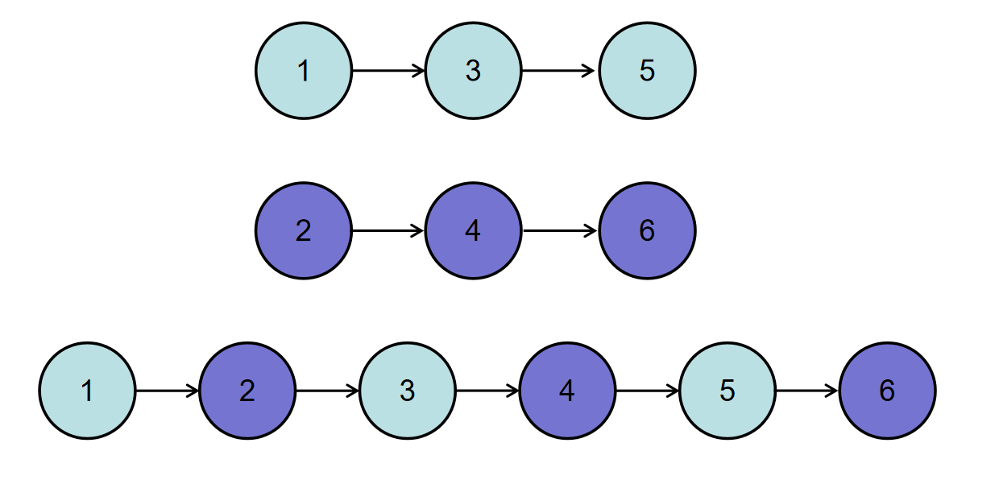
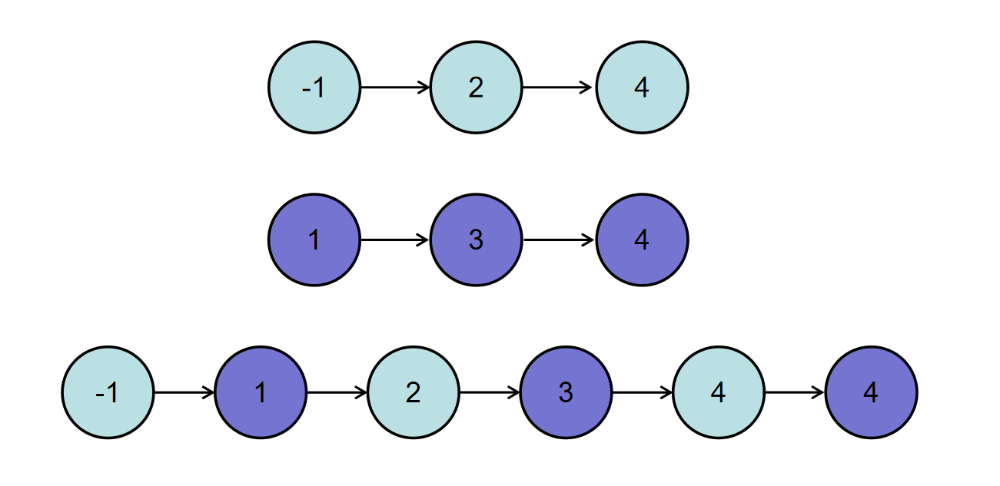

BM4 合并两个排序的链表


- 题目
- 题解(298)
- 讨论(1k)
- 排行

简单 通过率：31.82% 时间限制：1秒 空间限制：64M

知识点[链表](https://www.nowcoder.com/exam/oj?page=1&tab=算法篇&topicId=295?tag=580)[2021](https://www.nowcoder.com/exam/oj?page=1&tab=算法篇&topicId=295?tag=10059)

## 描述

输入两个递增的链表，单个链表的长度为n，合并这两个链表并使新链表中的节点仍然是递增排序的。

数据范围： 0 \le n \le 10000≤*n*≤1000，-1000 \le 节点值 \le 1000−1000≤节点值≤1000
要求：空间复杂度 O(1)*O*(1)，时间复杂度 O(n)*O*(*n*)

如输入{1,3,5},{2,4,6}时，合并后的链表为{1,2,3,4,5,6}，所以对应的输出为{1,2,3,4,5,6}，转换过程如下图所示：



或输入{-1,2,4},{1,3,4}时，合并后的链表为{-1,1,2,3,4,4}，所以对应的输出为{-1,1,2,3,4,4}，转换过程如下图所示：



## 示例1

输入：

```
{1,3,5},{2,4,6}
```

复制

返回值：

```
{1,2,3,4,5,6}
```

复制

## 示例2

输入：

```
{},{}
```

复制

返回值：

```
{}
```

复制

## 示例3

输入：

```
{-1,2,4},{1,3,4}
```

复制

返回值：

```
{-1,1,2,3,4,4}
```

复制

相似企业真题