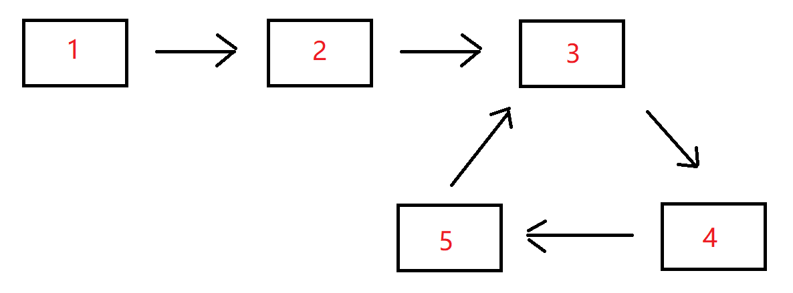

BM7 链表中环的入口结点


- 题目
- 题解(320)
- 讨论(1k)
- 排行

中等 通过率：36.76% 时间限制：1秒 空间限制：64M

知识点[链表](https://www.nowcoder.com/exam/oj?page=1&tab=算法篇&topicId=295?tag=580)[哈希](https://www.nowcoder.com/exam/oj?page=1&tab=算法篇&topicId=295?tag=585)[双指针](https://www.nowcoder.com/exam/oj?page=1&tab=算法篇&topicId=295?tag=5054)

## 描述

给一个长度为n链表，若其中包含环，请找出该链表的环的入口结点，否则，返回null。

数据范围： n\le10000*n*≤10000，1<=结点值<=100001<=结点值<=10000

要求：空间复杂度 O(1)*O*(1)，时间复杂度 O(n)*O*(*n*)

例如，输入{1,2},{3,4,5}时，对应的环形链表如下图所示：



可以看到环的入口结点的结点值为3，所以返回结点值为3的结点。

### 输入描述：

输入分为2段，第一段是入环前的链表部分，第二段是链表环的部分，后台会根据第二段是否为空将这两段组装成一个无环或者有环单链表

### 返回值描述：

返回链表的环的入口结点即可，我们后台程序会打印这个结点对应的结点值；若没有，则返回对应编程语言的空结点即可。

## 示例1

输入：

```
{1,2},{3,4,5}
```

复制

返回值：

```
3
```

复制

说明：

```
返回环形链表入口结点，我们后台程序会打印该环形链表入口结点对应的结点值，即3    
```

## 示例2

输入：

```
{1},{}
```

复制

返回值：

```
"null"
```

复制

说明：

```
没有环，返回对应编程语言的空结点，后台程序会打印"null"    
```

## 示例3

输入：

```
{},{2}
```

复制

返回值：

```
2
```

复制

说明：

```
环的部分只有一个结点，所以返回该环形链表入口结点，后台程序打印该结点对应的结点值，即2    
```

相似企业真题